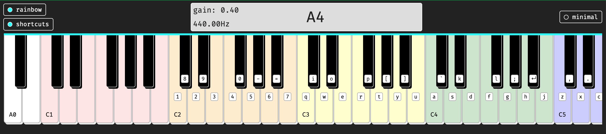

# Piano Keyboard

## Setup

Run `npx http-server` in your terminal to get this app started, or simply open index.html in your browser.

## Features

### Keyboard shortcuts

This is an 88 key piano, but not all the keys have keyboard shortcuts. There's keyboard shortcuts mapping for Octaves 2 to 5, where the middle octave is on the home row. I dedicated the right-most keys to the black keys, and the left 7 keys to the white keys, and each octave on its own row, so it's easy to remember. I wanted each key to have its own key mapping so that you can play multiple notes at once fine for chords. The shortcuts are on the keys by default for desktop but not for mobile (since you don't need them), and they are togglable on desktop.

### Fullscreen distraction-free mode

For desktop, the fullscreen mode works for when toggling the "minimal" setting. For mobile, fullscreen mode works when you create a homescreen shortcut, and open the app from there.

### Rainbow keys and notes guides

The keys are assigned colors depending on what octave they are, in order of the rainbow red, orange, yellow, green, blue, indigo, and violet, with A0 and C8 as white. This is because the keys aren't all visible at once, and scrolling needs to happen for you to play all the notes, so the rainbow is a guide, and cause I like rainbows. I also added the C octaves as a guide too, and A0. Not everyone wants rainbow keys, and also maybe not all the time, so that feature is toggleable.

### Display screen

The display screen shows what note is being played, and the gain and frequency as well. On desktop mode it also shows when you've entered and exited fullscreen mode. I didn't think it was necessary on mobile since you can't toggle fullscreen mode with how I made it made so far.

## Process and learnings

### How it started

It all started when I was curious on how to make sounds using JavaScript, how to make a beeping sound. I came across the StackOverflow article on how do I make JavaScript beep, and then looked for more info on it. I successfully made a beeping sound with a button press. Then I thought it would be cool if you could map the frequencies to notes to make music, and found that this was definitely possible, and someone shared a way to calcuate frequency to notes dynamically through a JavaScript function. I also found the muted.io site that was also an inspiration. I wanted to make a piano at that point, and got to work.

### Audio-related

I learned that you only need one `AudioContext` for all the `oscillators` and `gains`. Creating new ones each time makes the audio quality degrade over time, and is a lot less efficient. That helped with the sound creation being more consistent.

It was hard to debug issues at times, but people online encountered similar issues. Another issue was hearing a clicking noise after each oscillator stops. I learned that using a `exponentialRampToValueAtTime` or `linearRampToValueAtTime` to gradually turn down the volume and then stop the oscillator helps, but isn't perfect. I ended up going with `linearRampToValueAtTime` since it's more gradual. This is still a learning process, so I'll probably tweak it as I learn more. For instance I want to try using `AudioParam` instead to see how that goes, instead of changing the `gain` before stopping the `oscillator`.

From Mozilla's article on GainNode:
> "The gain is a unitless value, changing with time, that is multiplied to each corresponding sample of all input channels. If modified, the new gain is instantly applied, causing unaesthetic 'clicks' in the resulting audio. To prevent this from happening, never change the value directly but use the exponential interpolation methods on the AudioParam interface."

I learned that using the `sine` waves sounds the nicest to me, but it was hard to hear the lower frequencies, and `triangle` sounds the next best to me, and can hear all the frequencies, so I went with that. I also learned that the higher notes are ear-piercing, but adjusting the `gain` accordingly helps, so I set lower and lower gains as the frequency increases.

In the future I'd like to play with the `PerodicWave` to create my own wave form to sound more like a piano. I learned that in some cases, changing the `PerodicWave` changes the pitch, so it became in-accurate, though it sounded nicer. I also found a site called Audiosynth that someone made their own audio synthesizers for different instruments. It worked great for making the sound like a piano, but it wasn't a sustained note, and didn't work on mobile when I tried implementing. I'll have to research it more.

### Fullscreen-related

I wasn't able to get fullscreen mode to toggle on mobile, but I found a way to get it to work with homescreen button using a combination of `manifest.json` setting `<meta name="apple-mobile-web-app-capable" content="yes" />` and `<meta name="mobile-web-app-capable" content="yes" />` since I only have iOS to test on so far, and used all three for good measure. Somehow only using `manifest.json` didn't work for me in iOS.

## Testing

I haven't created automated tests for this project yet, but I manually tested it with Firefox, Chrome, and Safari on MacOS Desktop, and it works fine in them. I also tested in Firefox, Safari, Chrome, and Edge in iOS mobile. It works fine in Firefox, and Safari, but for Chrome and Edge, there is a slight lag so each note can be played with a pause in between, but that's not ideal. Hopefully I'll figure out a way to get it working fine across interfaces.

## Sources I used during research

This isn't all the sources I used, but I tried putting together what I could remember using so far.

- [StackOverflow](https://stackoverflow.com/questions/879152/how-do-i-make-javascript-beep)
- [Tutorial on JavaScript audio](https://marcgg.com/blog/2016/11/01/javascript-audio/) with explanations including what the types of waves are
- [AudioContext](https://developer.mozilla.org/en-US/docs/Web/API/AudioContext)
- [PerodicWave](https://developer.mozilla.org/en-US/docs/Web/API/PeriodicWave) for setting a custom oscillatort type
- [Notes frequencies chart](https://muted.io/note-frequencies/)
- [JSON and dynamic calculation for frequency to notes](https://gist.github.com/marcgg/94e97def0e8694f906443ed5262e9cbb)
- [Example](https://recursivearts.com/virtual-piano/) of playing with a keyboard mapping to notes on piano keys
- [Audiosynth](https://keithwhor.github.io/audiosynth/) for making it sound like a piano
- [AudioParam](https://developer.mozilla.org/en-US/docs/Web/API/AudioParam)
- [Making Fullscreen Experiences](https://web.dev/fullscreen/)
